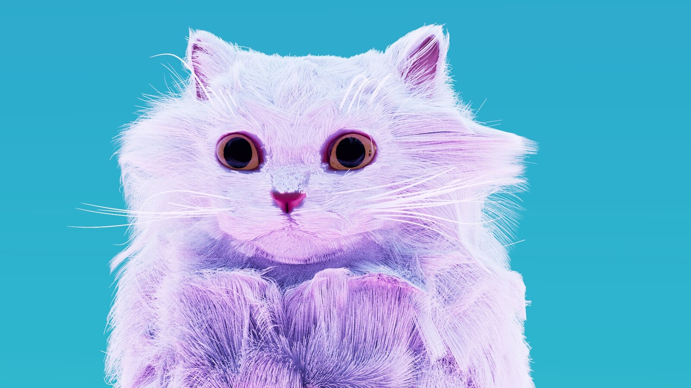

<!---  --->

---

# 💫 About Me:
| Parameter | Value |
| --- | --- |
| Name | Hashir |
| Interested in | GameDev, Linux and Rust |
| Email | hashir447079@gmail.com |
| Matrix | @bongopoyo:matrix.org |

<!---
HashirShazad/HashirShazad is a ✨ special ✨ repository because its `README.md` (this file) appears on your GitHub profile.
You can click the Preview link to take a look at your changes.

Banner by the amazing Clara.
--->
